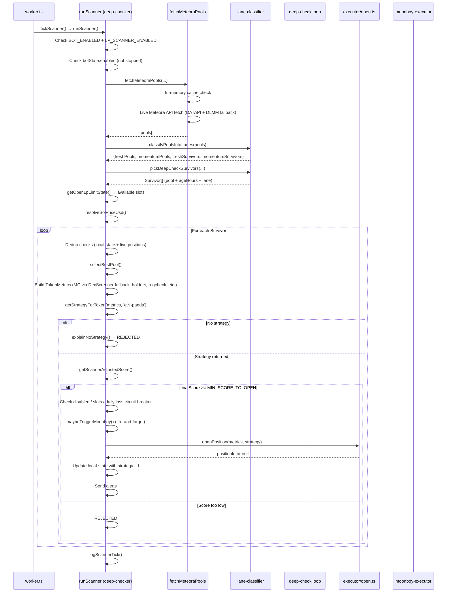
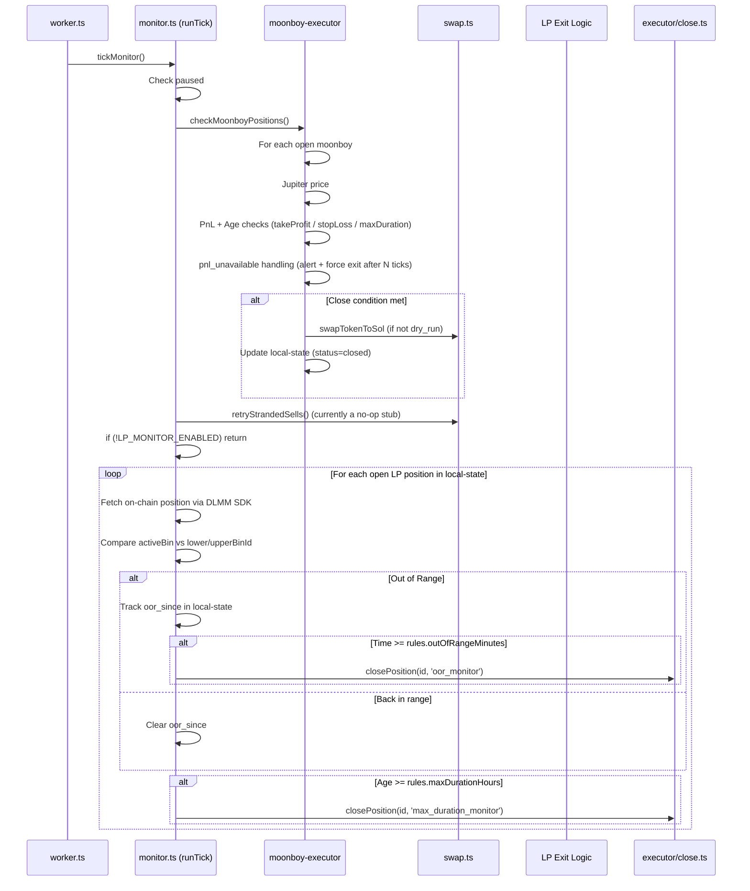

# Meteoracle Production Workflow (Code-Based)

**Generated from actual source code analysis** (worker.ts, deep-checker.ts, monitor.ts, moonboy-executor.ts, executor/*, telegram-bot.ts, local-state.ts, etc.)

This document describes the **real runtime behavior** when the bot runs in production (`npm run worker` or via PM2), not aspirational documentation.

---

## 1. High-Level Architecture

```
┌─────────────────────────────────────────────────────────────┐
│                        worker.ts                            │
│  - Starts two independent timers                            │
│  - tickMonitor() every LP_MONITOR_INTERVAL_SEC (default 60s)│
│  - tickScanner() every LP_SCAN_INTERVAL_SEC (default 900s)  │
└─────────────────────────────────────────────────────────────┘
                              │
          ┌───────────────────┴───────────────────┐
          ▼                                       ▼
┌──────────────────────┐              ┌──────────────────────┐
│   bot/monitor.ts     │              │ bot/scanner/deep-    │
│   (runTick)          │              │ checker.ts           │
│                      │              │ (runScannerOnce)     │
│ • checkMoonboy       │              │                      │
│ • retryStrandedSells │              │ • fetchMeteoraPools  │
│ • LP OOR + Duration  │              │ • classify lanes     │
│   exits → close      │              │ • deep checks        │
└──────────────────────┘              │ • score + decide     │
                                      │ • openPosition +     │
                                      │   maybeTriggerMoonboy│
                                      └──────────────────────┘
```

---

## 2. Scanner Tick Flow (Most Complex Path)



### Key Decision Points in Scanner

| Stage | Possible Outcomes | Code Location |
|-------|-------------------|---------------|
| Bot state | Stopped / Paused | botState.enabled |
| Pool fetch | Error / Empty | fetchMeteoraPools |
| Lane filtering | 0 survivors | classify + pickDeepCheckSurvivors |
| Per-survivor dedup | Skip (open / recent bad close) | local-state + live positions |
| Strategy selection | REJECTED (explainNoStrategy) | getStrategyForToken |
| Scoring | REJECTED (score < MIN_SCORE) | getScannerAdjustedScore + MIN_SCORE_TO_OPEN |
| Guards | disabled / no slots / daily loss | getDisabledStrategyReason + circuit breaker |
| Open | Success / null (executor failed) | openPosition |
| Moonboy | Triggered / Age gate / Disabled | maybeTriggerMoonboy |

---

## 3. Monitor Tick Flow



### Monitor Exit Rules (as actually coded)

- Uses `getPositionExitRules()` which reads from the position record (populated at open time from strategy).
- Falls back to 30m / 12h only if data is missing.
- Always calls `closePosition()` — actual fee claiming logic lives in `close.ts`.

---

## 4. Position Lifecycle (Open → Close)

### Opening Path (simplified)

1. Scanner decides `ACCEPTED`
2. `openPosition(metrics, strategy)` called
3. `persistence.ts` → `persistPosition()` writes to `state/open-lp-positions.json` with full strategy exit params
4. On-chain: Jupiter swap (if needed) + DLMM position creation (with bin shrinking validation)
5. Local state updated with `status: 'active'`

### Closing Paths

**Automatic**:
- Monitor: `oor_monitor` or `max_duration_monitor`
- Moonboy executor: `takeprofit_*`, `stoploss_*`, `max_duration_*`, `pnl_unavailable_*`

**Manual**:
- Telegram `/close <id>` → `closePosition(id, 'manual_telegram')`

**Inside closePosition** (actual behavior):
- Dry-run row → just mark closed
- `BOT_DRY_RUN=true` live position → refuse
- Real close:
  - `claimAllRewards()`
  - `removeLiquidity(shouldClaimAndClose: true)`
  - Post-close swap of remaining token → SOL (if any)
  - `markPositionClosed()` in local state

---

## 5. Telegram Control Paths

| Command | Effect on System | Code Path |
|---------|------------------|---------|
| `/tick` | Forces one full scanner + monitor cycle | Calls `runScanner()` + `monitorPositions()` directly |
| `/dry` / `/live` | Toggles `botState.dry_run` | `setBotState()` |
| `/stop` | `enabled=false`, `paused=true` + PM2 stop | Affects both worker timers |
| `/restart` | `enabled=true`, `paused=false` + PM2 restart | |
| `/close <id>` | Calls `closePosition(id, 'manual_telegram')` | Same as automatic close |
| `/add <id> <SOL>` | Calls add-liquidity logic | `executor/add-liquidity.ts` |
| `/status` / `/positions` | Read-only from local-state + botState | |

---

## 6. State Management (Single Source of Truth)

**Files**:
- `state/open-lp-positions.json`
- `state/open-moonboys.json`
- `state/bot-state.json` (via `lib/botState.ts`)

All components read/write these JSON files directly. No Supabase in hot paths.

---

## 7. Major Conditional Branches Summary

### Scanner
- `!BOT_ENABLED` → skip
- `!botState.enabled` → "bot_stopped"
- Pool fetch failure → error
- 0 survivors after lanes → early exit
- Per-token dedup / live position / recent bad close → skip
- Score < threshold → REJECTED
- No open slots / daily loss breaker → skip open
- `openPosition` returns null → logged as failure

### Monitor
- `botState.paused` → skip
- Moonboy price unavailable → alert + eventual force close
- LP position missing on-chain data → skip that position
- OOR time exceeded → close
- Duration exceeded → close

### Dry Run Behavior
- Scanner: Still evaluates everything, calls `openPosition` which respects `DRY_RUN`
- Monitor: Moonboy and LP closes become no-op (mark only)
- Close path has explicit dry-run branches

---

## 8. Error Handling Patterns

- Most per-item loops use `.catch(() => false)` or `console.warn`
- Watchdog timers on scanner ticks
- Null PnL handling with progressive alerts + forced exit for Moonboys
- Graceful shutdown in worker

---

**This document reflects the actual code as of the latest review.**  
All paths above were traced directly from `worker.ts`, `deep-checker.ts`, `monitor.ts`, `moonboy-executor.ts`, executor files, and `telegram-bot.ts`.

Would you like me to expand any specific flow (e.g., full closePosition internals or openPosition with all its guards) into more detailed diagrams?