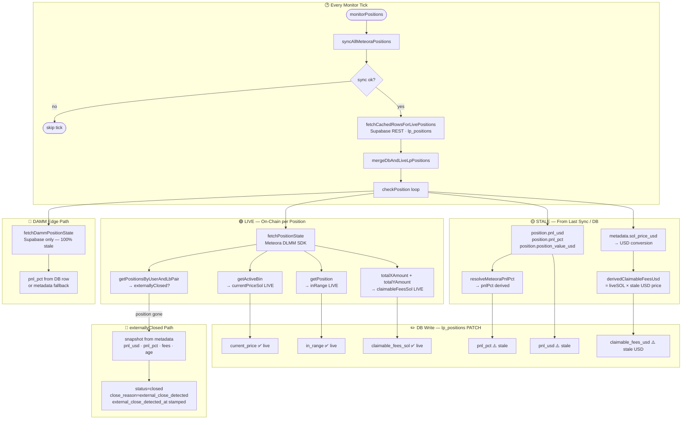

# Meteoracle — Data Flow: Live vs Stale

_Auto-generated. Last updated by monitor patch (May 2026)._

## Legend

| Symbol | Meaning |
|---|---|
| ✅ live | Fetched from chain / Meteora SDK on every tick |
| ⚠️ stale | Read from last `syncAllMeteoraPositions` DB write — can be 1 tick old |
| 🔴 externallyClosed | Position vanished on-chain; snapshot written from last known metadata |
| 🔵 DAMM | `fetchDammPositionState` is DB-only — no live on-chain call |

## Key Findings

- **`currentPriceSol`** — always live (DLMM SDK `getActiveBin`)
- **`inRange`** — always live (DLMM SDK `getPosition`)
- **`claimableFeesSol`** — always live (DLMM SDK `totalXAmount + totalYAmount`)
- **`pnl_usd` / `pnl_pct`** — sourced from last sync write; USD-stale by up to 1 tick
- **`claimable_fees_usd`** — live SOL qty × stale `sol_price_usd`; USD value drifts between syncs
- **`position_value_usd`** — fully stale; not recomputed at tick time
- **DAMM `pnl_pct`** — 100% stale (DB read only, no on-chain call)
- **`externallyClosed` snapshot** — patched (commit `419a1749`): now writes last-known PnL/fees/age before closing row
